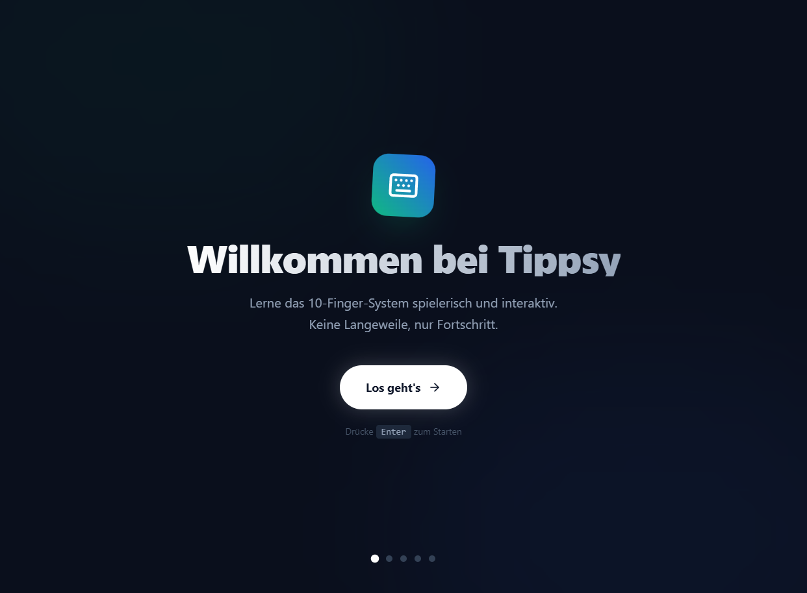
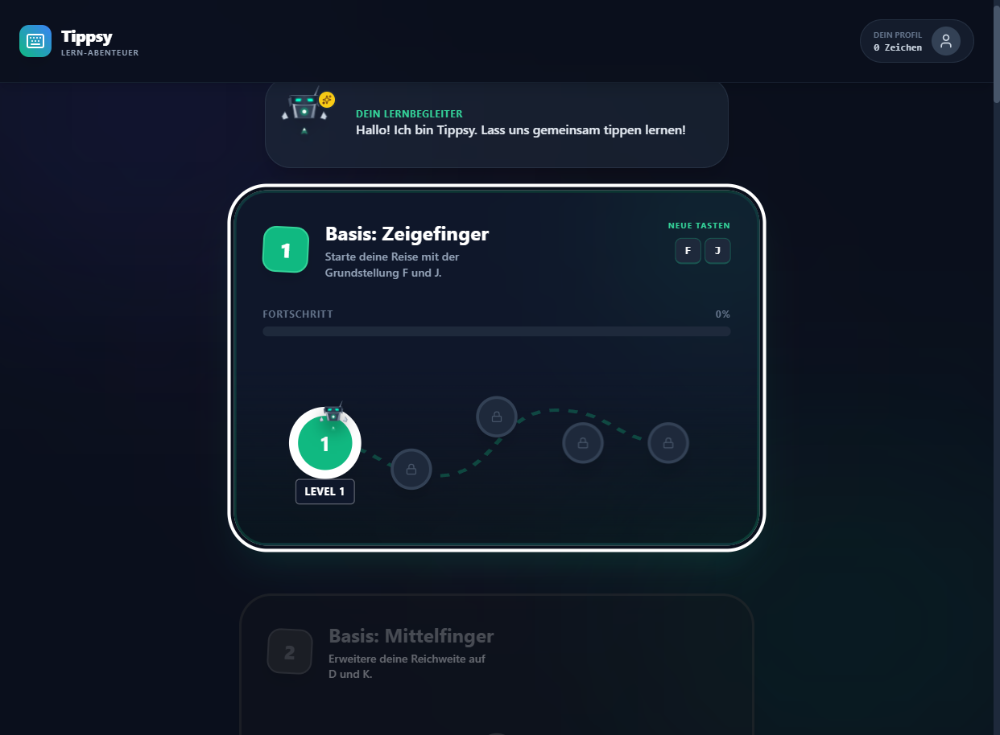
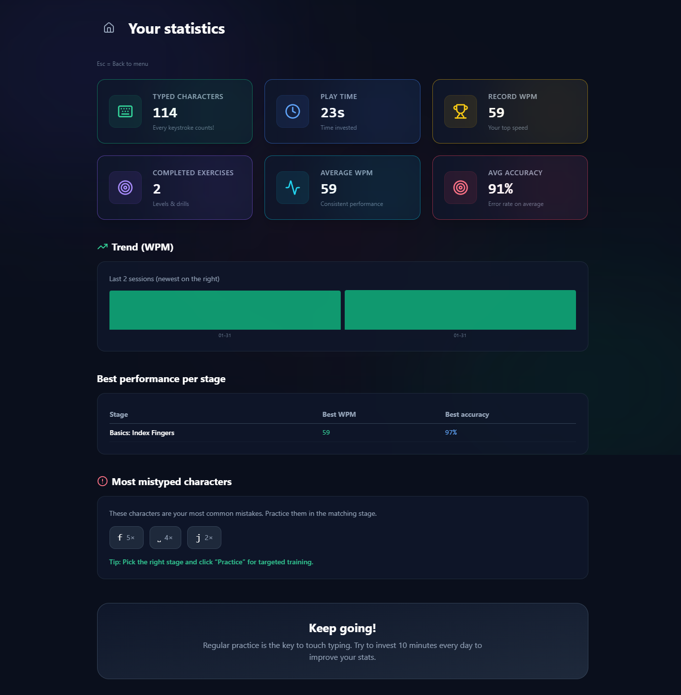
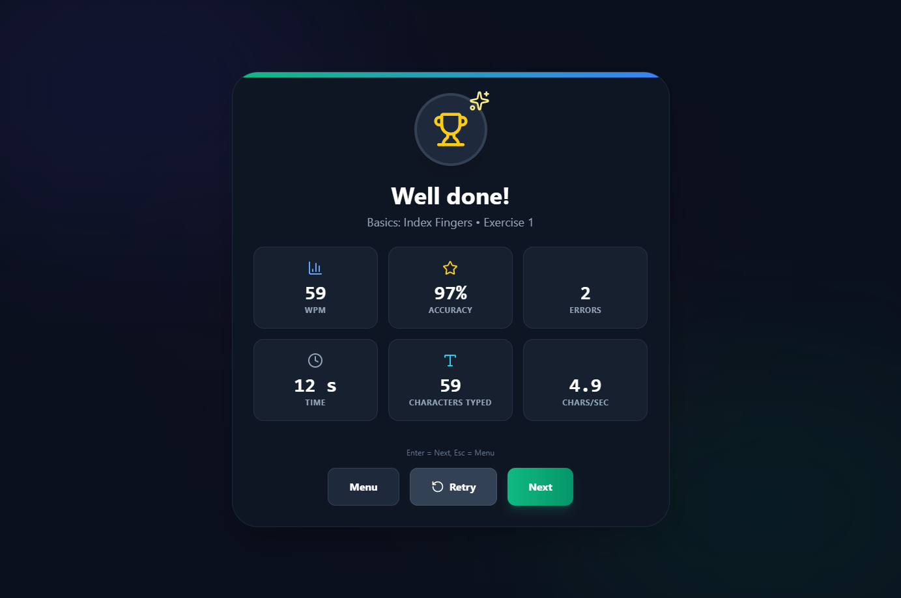
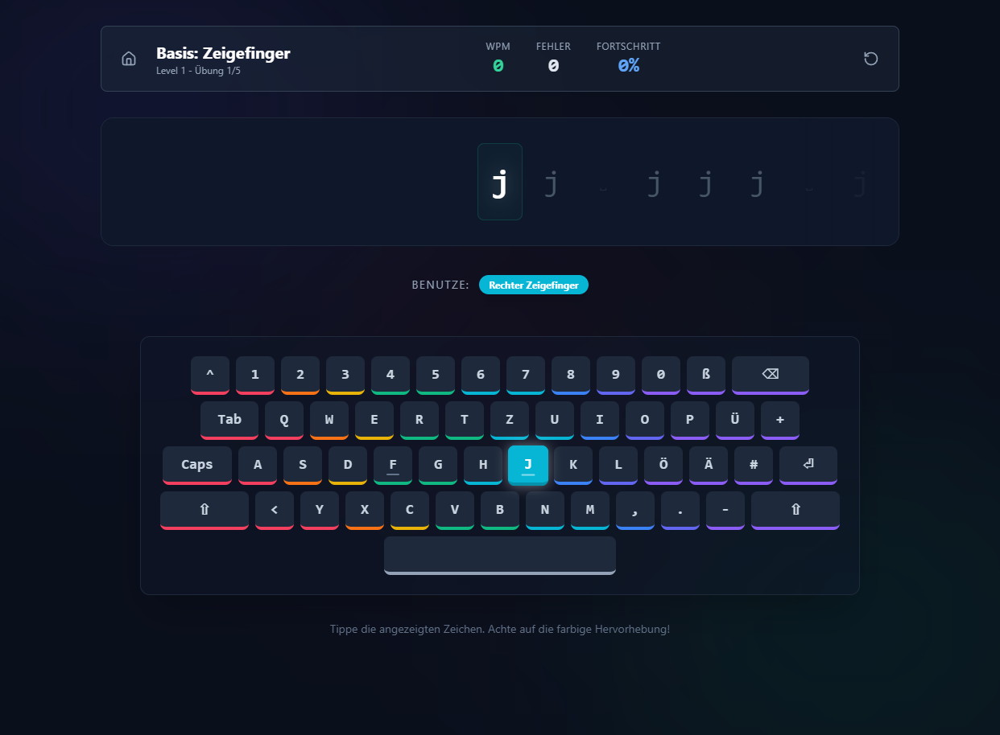
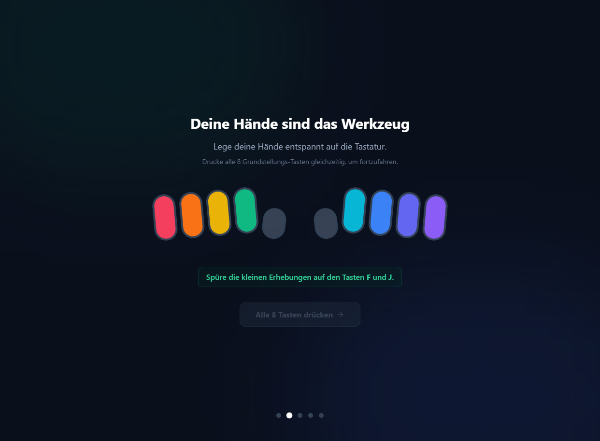

# ⌨️ Tippsy – Touch Typing Trainer

[🇩🇪 Deutsche Version](README.de.md)

**Learn touch typing in a playful and interactive way.**  
No boredom, just progress.

Tippsy is a web-based typing trainer optimized for the **German QWERTZ keyboard layout**. With structured lessons, the learning companion Tippsy, and clear statistics, you will improve your typing speed and accuracy step by step.

---

## 📸 Screenshots

| Start & Tutorial | Main Menu – Learning Path |
|------------------|---------------------------|
|  |  |

| Statistics | Exercise Completed |
|------------|--------------------|
|  |  |

| While Typing | Loading Lesson |
|--------------|----------------|
|  |  |

*Learning the home row – "Your hands are the tool":*  


---

## ✨ What is Tippsy?

- **Guided Learning Path:** Over 15 stages from index fingers (F & J) to special characters and the "Endless Zone".
- **Tippsy as a Companion:** A friendly learning companion guides you through the lessons.
- **German Keyboard:** Full support for QWERTZ including Ä, Ö, Ü, ß, and special characters.
- **Finger Assignment:** Each key is assigned to a finger; colorful virtual keyboard and hints (e.g., "Right Index Finger").
- **Statistics:** WPM, accuracy, errors, playtime, and progress per stage and across all sessions.
- **Different Modes:** Standard lessons, Free Practice per stage, Words & Sentences.

---

## 🚀 Installation

### Prerequisites

- **Node.js** (recommended: v18 or newer)  
  [nodejs.org](https://nodejs.org)

### Steps

1. **Clone or download the project**

   ```bash
   git clone <repository-url>
   cd Tippsy
   ```

2. **Install dependencies**

   ```bash
   npm install
   ```

3. **Start development server**

   ```bash
   npm run dev
   ```

   The app usually runs at `http://localhost:5173`. Open it in your browser and get started.

### Build for Production

```bash
 npm run build
 npm run preview
```

`npm run build` generates the files in `dist/`. With `npm run preview`, you can test the build locally.

---

## 📖 Usage

1. **First Start**  
   On your first visit, you'll see the welcome screen. Start with **"Let's go"** or **Enter**.

2. **Tutorial**  
   You will be guided through the home row (F and J, all 8 home row keys). This teaches you the correct hand position.

3. **Main Menu**  
   In the **Learning Adventure**, you see all stages. The current stage is highlighted; progress and level (1–5 per stage) are displayed.  
   - **Start Level:** Select a stage and click the desired level (or use keyboard: arrow keys, Enter).  
   - **Free Practice** or **Words & Sentences** per stage are accessible via the respective cards.

4. **Exercise**  
   - Characters appear one after another; type them with the displayed finger.  
   - The virtual keyboard highlights the next key in color.  
   - At the top, you see WPM, errors, and progress.

5. **After the Exercise**  
   You get an evaluation (WPM, accuracy, errors, time, characters).  
   - **Next** (or Enter): next exercise/level.  
   - **Retry:** same exercise again.  
   - **Menu** (or Esc): back to the main menu.

6. **Statistics**  
   Via **"Your Profile"** / Statistics, you can access typed characters, playtime, record WPM, completed exercises, average WPM, and accuracy.

### Keyboard Shortcuts (Selection)

- **Enter** – Start / Next  
- **Esc** – Back to menu (e.g., from statistics or results)  
- **Arrow Keys / W A S D** – Navigate between stages and levels in the menu  

---

## 🛠 Technology

- **React 19** + **TypeScript**
- **Vite 6** (Build & Dev Server)
- **Tailwind-compatible** utility classes (including Dark Theme)
- **Lucide React** for icons

---

## 📄 License

This project is licensed under the [GNU General Public License v3.0](LICENSE) (GPL-3.0).

---

*Good luck learning to type with Tippsy!* ⌨️
